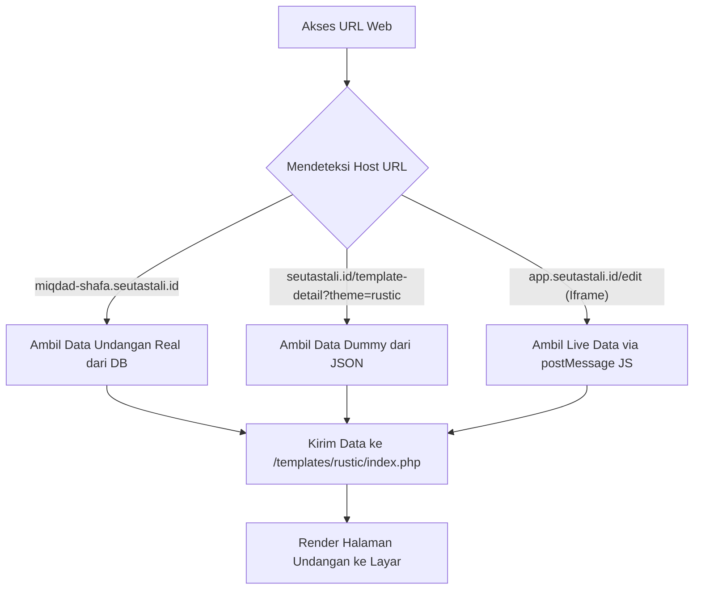

# Cetak Biru Arsitektur SaaS SeutasTali
### Struktur Direktori, Router Subdomain, & Sistem Render Template

Dokumen ini berisi rancangan arsitektur sistem tingkat produksi (*production-grade*) untuk platform **SeutasTali**. Panduan ini menjelaskan bagaimana cara mengelola subdomain dinamis undangan pernikahan user (misal: `miqdad-shafa.seutastali.id`), menggunakan satu file renderer template untuk preview maupun live, serta mengamankan folder `/dashboard` agar menghasilkan status 404 jika diakses langsung dari domain utama.

---

## 1. Desain Struktur Folder di Server (`public_html`)

Untuk menjaga kepraktisan integrasi dan pemeliharaan, seluruh aplikasi diletakkan dalam satu folder root `public_html` (flat repository structure) dengan pembagian subdomain menggunakan konfigurasi router server:

```text
/public_html                     <-- ROOT DOMAIN (seutastali.id) & WILDCARD (*.seutastali.id)
  ├── .htaccess                  <-- Server routing & Security Rules
  ├── index.php                  <-- Landing Page Utama / Route Loader
  ├── about.php                  <-- Halaman About publik
  ├── faq.php                    <-- Halaman FAQ publik
  │
  ├── /config                    <-- File Konfigurasi Global
  │     ├── bootstrap.php        <-- System initialization & Host Detector
  │     ├── app.php              <-- App configuration & Caching
  │     └── db.php               <-- Database Connection
  │
  ├── /assets                    <-- Shared Assets (Landing Page & Shared Libs)
  │     ├── /css
  │     └── /media
  │
  ├── /templates                 <-- MASTER TEMPLATES (Basis Desain Undangan)
  │     ├── /rustic              <-- Folder Tema Rustic
  │     │     ├── index.php      <-- Renderer Utama Tema Rustic
  │     │     ├── style.css      <-- Style Khusus Rustic
  │     │     └── dummy.json     <-- Data Contoh Pernikahan untuk Preview
  │     └── /modern              <-- Folder Tema Modern
  │           └── index.php
  │
  └── /dashboard                 <-- SUBDOMAIN APP (app.seutastali.id)
        ├── index.php            <-- Dashboard Landing (Edit Area)
        ├── assets/              <-- Assets khusus dashboard area
        └── edit-undangan.php    <-- Formulir edit undangan dengan iframe preview
```

---

## 2. Konsep Single-Page Renderer (Preview vs Live)

Anda **tidak perlu** menduplikasi file HTML/PHP untuk setiap undangan baru yang dibuat oleh user. Cukup gunakan satu renderer dinamis untuk setiap tema template.

### Diagram Alir Data (*Data Flow*):



### Implementasi Contoh File Tema (`/templates/rustic/index.php`):

```php
<?php
/**
 * Single-Page Renderer - Tema Rustic
 * Location: /templates/rustic/index.php
 */

// 1. Tentukan Sumber Data (Live DB, Dummy Preview, atau Iframe Edit)
if (isset($is_preview) && $is_preview) {
    // Mode Preview dari Landing Page: Load data contoh
    $data = json_decode(file_get_contents(__DIR__ . '/dummy.json'), true);
} elseif (isset($is_live_edit) && $is_live_edit) {
    // Mode Edit di Dashboard: Data akan disuntikkan secara realtime via Javascript postMessage
    $data = []; // Kosong secara default, diisi via JS
} else {
    // Mode Live Undangan User (misal: miqdad-shafa.seutastali.id)
    // Data pernikahan diambil dari database yang dilewatkan oleh bootstrap router
    global $user_invitation_data;
    $data = $user_invitation_data; 
}
?>
<!DOCTYPE html>
<html lang="id">
<head>
    <meta charset="UTF-8">
    <title><?= htmlspecialchars($data['bride_name'] ?? 'Mempelai Wanita') ?> & <?= htmlspecialchars($data['groom_name'] ?? 'Mempelai Pria') ?></title>
    <link rel="stylesheet" href="style.css">
</head>
<body>
    <div id="invitation-container">
        <h1 class="couple-title"><?= htmlspecialchars($data['bride_name']) ?> & <?= htmlspecialchars($data['groom_name']) ?></h1>
        <p class="wedding-date">Tanggal: <?= htmlspecialchars($data['event_date']) ?></p>
        <p class="wedding-location">Lokasi: <?= htmlspecialchars($data['event_location']) ?></p>
    </div>

    <?php if (isset($is_live_edit) && $is_live_edit): ?>
    <!-- Script khusus Live Preview di Dashboard (Menggunakan Iframe postMessage) -->
    <script>
        window.addEventListener('message', function(event) {
            // Terima data perubahan realtime dari form dashboard luar
            const updatedData = event.data;
            if (updatedData && updatedData.type === 'UPDATE_FIELDS') {
                document.querySelector('.couple-title').innerText = updatedData.bride_name + ' & ' + updatedData.groom_name;
                document.querySelector('.wedding-date').innerText = 'Tanggal: ' + updatedData.event_date;
                document.querySelector('.wedding-location').innerText = 'Lokasi: ' + updatedData.event_location;
            }
        });
    </script>
    <?php endif; ?>
</body>
</html>
```

---

## 3. Router Subdomain Dinamis (`*.seutastali.id`)

Dengan mengaktifkan **Wildcard Subdomain (`*.seutastali.id`)** di Control Panel CPanel/Hostinger Anda, semua subdomain otomatis terarah ke file `index.php` di root `public_html`. Kita menangani pembagian halaman secara cerdas di `config/bootstrap.php`:

### Kode Pendeteksi Subdomain (`config/bootstrap.php`):

```php
<?php
/**
 * Host & Subdomain Router (Diletakkan di config/bootstrap.php)
 */

$host = strtolower($_SERVER['HTTP_HOST'] ?? 'seutastali.id');
$host_parts = explode('.', $host);

// Tentukan domain utama (misal di localhost/seutastali.id)
$subdomain = '';
if (count($host_parts) > 2) {
    $subdomain = $host_parts[0];
}

// ----------------------------------------------------
// SYSTEM ROUTING LOGIC
// ----------------------------------------------------
if ($subdomain !== '' && !in_array($subdomain, ['www', 'app', 'admin', 'api'])) {
    // 1. INI ADALAH UNDANGAN USER (Contoh: miqdad-shafa.seutastali.id)
    // Ambil data undangan aktif berdasarkan nama subdomain dari Database
    require_once ROOT_PATH . 'config/db.php';
    global $conn;
    
    $safe_subdomain = $conn->real_escape_string($subdomain);
    $query = $conn->query("SELECT * FROM invitations WHERE subdomain = '$safe_subdomain' LIMIT 1");
    
    if ($query && $query->num_rows > 0) {
        $user_invitation_data = $query->fetch_assoc();
        $selected_theme = $user_invitation_data['theme_folder']; // misal 'rustic'
        
        // Langsung render file template milik user tanpa mengubah URL di browser!
        include ROOT_PATH . "templates/$selected_theme/index.php";
        exit; // Matikan eksekusi script agar tidak meload halaman landing page!
    } else {
        // Subdomain tidak terdaftar di database -> Tampilkan 404 Undangan
        http_response_code(404);
        include ROOT_PATH . 'errors/404-undangan.php';
        exit;
    }
}
```

---

## 4. Keamanan Folder `/dashboard` (Memaksa Akses Utama Jadi 404)

Karena folder `dashboard` secara fisik diletakkan di dalam `public_html`, secara default pengunjung bisa mengakses `seutastali.id/dashboard` secara langsung. Untuk memblokir akses langsung ini dan memaksanya membuang status **404 Not Found** (sehingga folder `/dashboard` **hanya** bisa diakses via subdomain `app.seutastali.id`), kita gunakan konfigurasi `.htaccess` berikut:

### Aturan Keamanan Folder di `.htaccess`:

```apache
# =================================================================
# KEAMANAN SUBDOMAIN & BLOKIR AKSES DIREKTORI LANGSUNG
# =================================================================

# 1. Arahkan subdomain "app.seutastali.id" ke folder "/dashboard" secara transparan
RewriteCond %{HTTP_HOST} ^app\.seutastali\.id$ [NC]
RewriteCond %{ENV:REDIRECT_STATUS} ^$
RewriteCond %{REQUEST_URI} !^/dashboard/
RewriteRule ^(.*)$ dashboard/$1 [L,QSA]

# 2. BLOKIR AKSES LANGSUNG dari domain utama ke folder "/dashboard" (Kirimkan 404)
# Aturan ini memastikan seutastali.id/dashboard menghasilkan halaman 404 murni
RewriteCond %{HTTP_HOST} !^app\. [NC]
RewriteCond %{REQUEST_URI} ^/dashboard [NC]
RewriteRule ^dashboard - [R=404,L]
```

### Cara Kerja Aturan Ini:
1. Pengunjung mengetik `app.seutastali.id` -> Server secara transparan menyajikan isi dari folder `/dashboard` tanpa mengubah tulisan URL di browser pengguna.
2. Pengunjung iseng mengetik `seutastali.id/dashboard` -> Server mendeteksi bahwa host **bukan (`!`)** `app.` tapi url-nya mengakses folder `/dashboard`, sehingga server langsung melempar kode respon **404 Not Found** murni seolah-olah folder tersebut tidak pernah ada!

---

> [!NOTE]
> Dengan arsitektur ini, sistem aplikasi SeutasTali Anda akan menjadi sangat aman, efisien, hemat penyimpanan disk hosting, dan memberikan pengalaman pembuatan undangan digital kelas premium yang setingkat dengan platform berskala besar.
