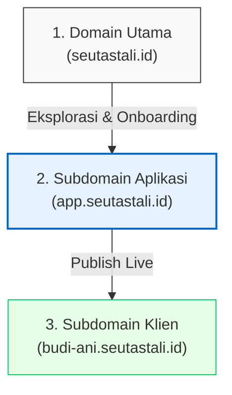

# Seutastali.id: Cetak Biru Alur Pengguna (User Flow Blueprint)

Dokumen ini mendefinisikan arsitektur alur pengguna (*User Flow*) premium dan bebas hambatan (*frictionless*) untuk platform undangan digital **Seutastali.id**. Cetak biru ini mengadopsi model **Try-Before-Buy (Sandbox Mode)** yang terbukti menghasilkan tingkat konversi penjualan tertinggi di industri SaaS modern.

---

## 🏛️ Pembagian Peran Arsitektur Domain

Untuk memastikan performa kecepatan SEO yang luar biasa dan keamanan sesi akun, domain dibagi menjadi tiga wilayah terisolasi:



*   **Domain Utama (`seutastali.id`):** Berfungsi sebagai etalase pemasaran statis, katalog template, informasi paket harga, dan halaman checkout awal.
*   **Subdomain Aplikasi (`app.seutastali.id`):** Berfungsi sebagai mesin utama aplikasi (*SaaS Engine*) yang menangani Sandbox Editor, proses Onboarding Terpadu, Dashboard Klien, serta database RSVP/Tamu.
*   **Subdomain Klien (`[namakustom].seutastali.id`):** Halaman undangan digital aktif milik klien yang diakses oleh para tamu undangan, dirancang super ringan tanpa beban skrip editor.

---

## 🗺️ Peta Alur Perjalanan Pengguna (User Journey Map)

### Tahap 1: Eksplorasi & Pemilihan Template (Domain Utama)
*   User mengunjungi katalog template di halaman **`seutastali.id/templates.php`**.
*   User melihat-lihat variasi desain yang indah, lalu mengklik tombol **"Coba Template"** pada template pilihan mereka.

### Tahap 2: Sandbox Editor - Bersenang-senang Mengedit Gratis (Subdomain Aplikasi)
*   Sistem mengarahkan user secara instan ke halaman editor sandbox di **`app.seutastali.id/sandbox/[nama-template]`** (contoh: `app.seutastali.id/sandbox/floral`) dengan status tamu anonim (*guest session*).
*   **Pop-up Panduan Kustomisasi:** Muncul panduan visual interaktif singkat yang menunjukkan cara mengganti nama pengantin, mengubah warna font, dan mengunggah foto.
*   User langsung mencoba mengedit undangan secara nyata:
    *   Mengisi nama panggilan pengantin (judul undangan langsung berubah real-time).
    *   Memasukkan tanggal pernikahan (countdown timer langsung aktif berdetak).
    *   Mengunggah satu foto prewedding (latar belakang undangan langsung berganti indah).
*   User melihat hasil rancangan awal mereka melalui *Live Preview* yang memiliki watermark halus "Draf Uji Coba".

### Tahap 3: Penyimpanan Karya (Subdomain Aplikasi)
*   Setelah puas mengedit, user mengklik tombol menonjol **"Aktifkan & Sebarkan Undangan"** atau **"Simpan Draf"**.
*   **Pop-up Pengamanan Draf:** Muncul formulir mini yang ramah:
    > *"Undangan Kakak sudah sangat cantik! Amankan hasil rancangan Kakak sekarang agar tidak hilang."*
*   User hanya perlu memasukkan **Nama** dan **Email/No. WhatsApp**.
*   Setelah diisi, draf template beserta seluruh perubahan teks/foto tersimpan aman di database draf sementara.

### Tahap 4: Onboarding Terpadu & Transaksi Sukses (Subdomain Aplikasi)
User diarahkan ke sistem **Onboarding Stepper** 4-langkah yang mulus di dalam **`app.seutastali.id/onboarding`**:

```text
[ Step 1: Info Akun ] ➡️ [ Step 2: Detail Data ] ➡️ [ Step 3: Pilih Paket ] ➡️ [ Step 4: Pembayaran ]
```

*   **Step 1: Informasi Akun (Login/Register):**
    *   Sistem secara otomatis mendaftarkan akun baru menggunakan WhatsApp yang diinput pada Tahap 3.
    *   User diminta membuat password unik untuk keamanan akun mereka di masa depan.
*   **Step 2: Kelengkapan Detail Pernikahan:**
    *   User mengisi data pendukung secara lengkap (nama orang tua, alamat lengkap gedung, dan koordinat Google Maps untuk rute tamu).
*   **Step 3: Pemilihan Paket Harga:**
    *   User memilih paket harga yang sesuai dengan kebutuhan fitur mereka (Dasar / Lengkap / Eksklusif / Premium).
*   **Step 4: Gerbang Pembayaran:**
    *   Formulir tagihan terintegrasi langsung dengan Midtrans. User melakukan pembayaran instan menggunakan QRIS atau Transfer Bank.
    *   *Proses Latar Belakang:* Begitu pembayaran terverifikasi sukses, status undangan diubah menjadi `Aktif`, watermark dihapus, dan subdomain kustom yang dipilih (misal: `budi-ani.seutastali.id`) diaktifkan secara instan.

### Tahap 5: Distribusi & Pengelolaan Masa Depan
*   **WhatsApp Notification:** Sistem secara otomatis mengirimkan WhatsApp selamat bergabung berisi tautan undangan resmi mereka dan detail kredensial akun untuk login di masa mendatang.
*   **Dashboard Pengguna:** Saat user kembali masuk (*login*) di masa mendatang ke **`app.seutastali.id`**, sistem mendeteksi akun aktif mereka dan langsung menampilkan **Welcome Widget**:
    > *"Undangan Budi & Ani telah aktif! Anda dapat membagikan link budi-ani.seutastali.id, memantau tamu RSVP, atau mengubah detail informasi kapan saja."*

---

## 📊 Keunggulan Utama Dibanding Kompetitor (Katsudoto)

| Parameter UX | Alur Berbelit Kompetitor | Alur Bebas Hambatan Seutastali |
| :--- | :--- | :--- |
| **Waktu Menuju Value** | Lambat (8-10 menit). Harus register, verifikasi email, dan bayar sebelum bisa melihat editor. |  **Super Instan (5 detik).** Langsung coba editor gratis di detik pertama mendarat. |
| **Hambatan Registrasi** | Sangat Tinggi. Formulir panjang dan kewajiban verifikasi email/OTP yang membosankan di awal. |  **Hampir Nol.** Registrasi disamarkan secara halus di akhir proses penyimpanan draf. |
| **Psikologi Pembayaran** | Pengguna skeptis membayar untuk sesuatu yang belum mereka ketahui kualitasnya. |  **Sunk Cost Fallacy.** Pengguna dengan senang hati membayar karena undangan sudah 100% jadi mereka buat. |
| **Keamanan Sesi Browser** | Sering terjadi *logout* sendiri atau session terputus karena bolak-balik domain. |  **100% Stabil.** Proses checkout & onboarding disatukan penuh di dalam subdomain aplikasi terpadu. |
